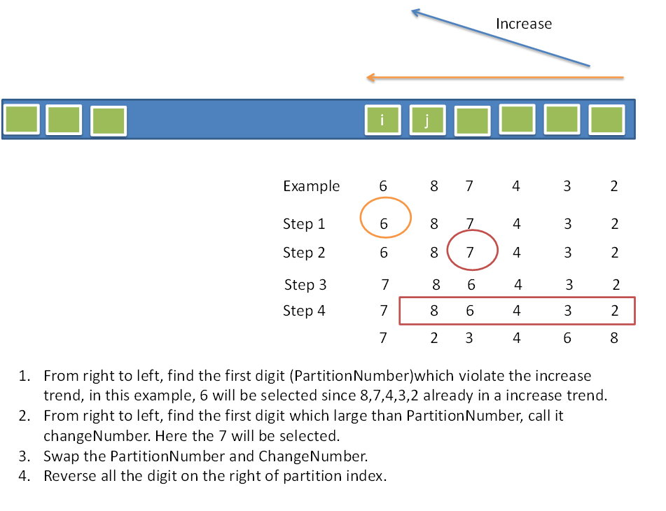

贪心法：子问题可以决定父问题，如子串中含有重复字符，则父串中一定含有重复字符。动规中单个子问题只能影响父问题，不足以决定父问题。

2.1.4 Search in Rotated Sorted Array II

> 包含重复元素的翻转数组中查找给定值的元素，若存在该元素则返回其下标，否则返回-1
> 
> 分析：
> 
> 翻转数组：0 1 2 4 5 6 7 might become 4 5 6 7 0 1 2
> 
> 若无重复元素，当A[m]>=A[l]时，可判定【l, m】为递增序列
> 
> 包含重复元素时，上述假设不成立，如[1,3,1,1,1]，此时需要进一步判定：
> 
> - 若A[m]>A[l]，则区间[l, m]一定递增
> 
> - 若A[m]==A[l]，则无法确定，此时递增l++，做进一步的判定

2.1.5 Median of Two Sorted Arrays

> 给定有序数组A和B，其大小分别为m和n，求两个数组排序后的中间值，时间复杂度为O(log(m+n))
> 
> 分析：
> 
> 经典题，可延伸求两个有序数组中的第k大元素。
> 
> - 若时间复杂度无要求，则使用最简单的方法：合并两数组至一个中，然后第k个位置的数即为结果。此时时间复杂度为O(m+n);
> 
> - 利用两个有序数组的特点，分别用pA和pB指向A和B的起实位置，然后用计数器m表示当前找到的第m大元素。时间复杂度O(k)，空间复杂度O(1)。缺点是当k接近m+n时，时间复杂度还是O(m + n)。伪代码如下。
> 
> ```
> m = 0;
> val = min(*pA, *pB)
> while (m < k - 1)
> {
>  if (*pA > *pB) {val=*pB; pB++;}
>  elif (*pA < *pB) {val=*pB; pA++;}
>  else {val=*pA; pA++; pB++; m+=1;}
>  m+=1;
> }
> ```
> 
> - 类似二分查找，每次过滤到一部分数据，然后更新要查找的位置；
> 
> ```
> 为方便后续计算，指定数组维度小的为pA,长度为m
> if k=1 {val = min(*pA, *pB)}
> if m==0 {val=*(pB + k-1)
> 
> ia = min(k/2, m) //指定小维度指针的目的是对元素个数进行判断
> ib = k - ia
> if (*(pA + ia - 1)>*(pB + ib - 1)){舍弃pB中前ib个元素, 更新要查找的位置k'=k-ib}
> elif (*(pA + ia - 1)<*(pB + ib - 1)){舍弃pA中前ia个元素，更新要查找的位置k'=k-ia}
> else {return *(pA + ia - 1)}
> ```

2.1.9 3Sum Closest

> 从数组中找到3个元素的组合，使其和与给定的数字最接近，并返回该和值。
> 
> 如S={-1 2 1 -1}，目标元素为-1，则输出结果为2(-1 + 2 + 1 = 2)
> 
> 分析：
> 
> 先排序，然后左右夹逼，时间复杂度为O(n<sup>2</sup>)，空间复杂度为O(1)。以当前位置为参考点，下一个元素和倒数第一个元素为另外两个元素，依次更新后边两个元素的位置至重合;然后更新当前元素的位置。
> 
> ```
> sort(arr);
> gap = INTMAX
> for (i = 0; i<size - 2;i++)
> {
> 
>     next = i + 1;
>     last = size - 1;
>     while(next < last)
>     {
>         cursum = arr[i] + arr[next] + arr[last];
>         curgap = target- cursum;
>         if (curgap < gap)
>         {
>             gap = curgap;
>             result = gap;
>         }
>         if (cursum < target) {++next;}
>         else {--last;}
> 
>     }
> 
> }
> ```

2.1.18 Climbing Stairs

> 长度为N的楼梯，每次上楼梯时只能走一步或两步，求一共存在多少种方法可以到楼梯顶。
> 
> 分析：
> 
> 到达第k层楼梯时，有两种情况：从k-1阶走一步或从k-2阶走两步，即f(k)=f(k-1) + f(k-2)。
> 
> 那么如何初始化呢，
> 
> 若对前两阶楼梯初始化，分别对应f(1)=1, f(2)=2，然后从第三阶台阶利用公式f(k)=f(k-1)+f(k-2)依次迭代到顶层即可。此种情况下需要对当前位置赋值为独立的变量；
> 
> 考虑到当前位置只和前两个相邻元素相关，故可以使用**类似滚动数组**的方式来计算到达当前位置时的方法数。
> 
> ```
> prev=0;  //前一个的方法数
> cur=1;  //当前位置的方法数
> for (i=0; i < n; i++)
> {
>     tmp = cur;  //保留当前位置的方法数
>     cur += prev  //更新当前位置结果,左侧cur=f(i)，则右侧cur视为f(i-1),prev视为f(i-2)
>     prev = tmp   //更新前一个位置结果
> }
> ```
> 
>   斐波那契数列，可以利用公式计算
> 
> pass

2.1.21 Gas Station

> 有N个气站围成一圈，气站的存量用gas(i)表示，从i气站移动到第i+1个气站时耗费cost(i)的燃气。求能否开车绕气站环绕一周，若可以则返回起始气站位置，否则返回-1。保证答案的唯一性。
> 
> 分析：
> 
> 若可以环绕一周，则总的剩余量sum(gas(i)-cost(i))应该大于零，否则不能环绕一周；
> 
> 起始气站的位置需要具备每次走过一个气站，剩余燃气量应该大于等于0，否则该气站不能作为起点；
> 
> 所以该题是要对整体的差值和与局部的差值和进行计算。对于答案的唯一性，只要返回第一个局部求和到最后仍大于零的位置即可。

2.2.9 Reverse Nodes in k-Group

> 以k为间隔，反转链表该组合内的值，对于不足k个元素的组合保留原位置即可。不能使用额外的内存。如对于给定链表1->2->3->4->5
> 
> 当k=2时，结果为2->1->4->3->5
> 
> 当k=3时，结果为3->2->1->4->5
> 
> 分析：
> 
> 迭代版：最外层循环用来对链表进行分组，得到当前组合的前一个指针和结束指针，内部循环对当前组合采用头插法(保留组合前一个指针的目的)进行反转。具体操作为先保留当前组合之后的部分，然后对当前组合内的元素，利用该组合前一个元素作为prev，然后依次插入到prev之后；
> 
> **递归版**：**先判断返回条件，包括头指针为空或只有头指针或剩余元素少于设定的值；更新条件为计算每个组合的结束位置；当前处理内容为header和组合结束位置之间进行反转，由于不知道之前组合的内容，故将当前组合分为两个链表**：prev和cur，其中prev用于保留已经反转的链表，cur之后为待反转的链表，最后返回prev即可。

2.2.12 Linked List Cycle II

> 判断链表中是否有环，**有则返回环的起始位置**，无则返回null。空间复杂度为O(1)。
> 
> 分析：
> 
> 快慢指针可以判断链表内是否存在环；
> 
> 如何计算环的起始位置呢？
> 
> 若存在环，设相遇时慢指针移动了s的距离，由于快指针可能在环内循环移动多次，故存在  2s=s+nr，即s = nr
> 
> 设链表头到环入口的距离为x，环入口到相遇点的距离为a，环的长度为r，链表长度为L。 当存在环时，由慢指针移动的距离为nr可得。
> 
> x+a = nr=(n -1)r + L-x     ——》x=(n-1)r + L-x-a ——》x = (n-1)r + r-a
> 
> 所以，**快慢指针相遇后，从相遇点到环起点的位置即为链表头到环入口的距离**。

2.2.13 Reorder List

> 对给定链表，按照位置[0, n-1, 1, n-2, …]重新排序，由于链表长度为奇偶时最后的下标不一致，故新链表的结束位置。空间复杂度为O(1)。
> 
> 如{1，2，3，4}重新排序后为{1，4，2，3}
> 
> 分析：
> 
> 类似使用两个指针来完成链表翻转的方法，可以将原链表从中间截断(使用快慢指针的方法)，然后对后部分链表翻转，最后对前半段链表和翻转后的链表进行组合即可。

3.5 Longest Palindromic Substring

> 从给定字符串中返回最长的回文字符串
> 
> 分析：
> 
> 回文字符串格式为abcdcba，对于该格式的判断可由如下形式。
> 
> - 最直观的判断是第一个和最后一个字母相同，第二个和倒数第二个相同，依次遍历至字符串长度的一半，若都满足则该字符串为回文串；
> 
> - 直接判断[i, j]区间的字符串是否为回文串，表示为f(i, j)，根据i和j的大小可以分为三种情况
> 1. i==j，此时肯定为回文串；
> 
> 2. i+1=j，若S[i]==S[j]，则[i, j]区间为回文串；
> 
> 3. i+1 < j，若f(i+1, j-1) && S[i]==S[j]，则该区间为回文串(**子区间[i+1, j-1]为回文串，且端点值相同**)； 
> 
> 直接判断的方法每次都需要重新判断字符串是否为回文串(如在原回文串两侧增加相同的字母时，由于没有记忆之前的判断结果，所以需要对整个字符串重新进行判断)，不易扩展。若利用此方法获得最长回文串时，需要对原字符串中任意两个点间的子串进行判断，时间复杂度为O(n<sup>2</sup>)
> 
> 对于直接判断f(i, j)间是否为回文串的方法，本质上是动态规划的思想，即给出初始化值，然后从下向上，依次判断当前区间是否满足回文串的定义。
> 
> 以上是借助回文串定义来解决最长回文串的问题，此时需要用变量表示计算到当前区间时，已知的最长回文串的大小和位置；利用记忆化搜索(备忘录)可以直接计算出区间内最长的回文字符串，具体操作是pass

3.8 Longest Common Prefix

> 数组字符串中，所有字符串最长的公共前缀。
> 
> 分析：
> 
> 可以对数组元素进行横向和纵向两个方向的扫描分别来解决。
> 
> 横向扫描：比较的维度为两个字符串的组成部分。以第一个位置的字符串为参考串，对第二个位置的字符串按照其维度依次与第一个位置字符串的当前位置进行比较，得到这两个字符串的公共前缀，并记录该公共前缀最右侧位置。遍历其他字符串，所有最右侧位置的最小值即为该数组字符串的公共前缀最右侧的位置。左侧位置为任意一个字符串的起点位置。
> 
> 纵向扫描：比较的维度为当前列中的所有字符串。依次计算所有字符串中当前索引的值是否相等，若相等则迭代进行下一列元素的判断，若不相等，则返回第一个字符串的初始位置到该索引位置的字符串。

4.1.3 Largest Rectangle in Histogram

> 对于宽度为1，高度不同的bar而言，求直方图中的最大矩形面积。
> 
> 如直方图的高度依次为[2,1,5,6,2,3]，则最大矩形面积为5\*2=10
> 
> 分析：
> 
> 计算每个位置所在的最大矩形，即从当前位置向两侧扩展，遇到比该位置高度小的则停止扩展，然后计算该区域的面积，并用一个值保留所有面积的最大值。该方法的时间复杂度为O(n<sup>2</sup>)。解法类似于12.6题的容器最多盛多少水。
> 
> 维持一个递增的栈变量用来存储元素下标，若当前位置大于栈顶元素，则入栈，否则保留当前位置，并对栈内元素计算其面积：弹出栈顶元素作为当前计算面积的高度值，对于当前计算的宽度值，若栈变量不为空，则矩形宽度为i-1-s.top()值(第i-1个元素为待计算矩形的右边界，起始位置为s.top()之后的元素(栈顶元素已弹出))；若栈变量为空，则矩形宽度为i-tmp(栈内最后一个元素)。其实无论栈是否为空，都可以将不符合栈变量递增的第一个数作为终点，当前弹出栈的元素为起点，计算两者之间的查值作为矩形的宽度。为保证计算的连续性，故在原数组后增加一个元素0，从而使原数组中所有的压入栈内的元素都可以弹出来(都比元素0要大)。

5.1.6 Binary Tree Zigzag Level Order Traversal

>   对于给定二叉树，按照Z字形输出，即先按照从左到右输出当前层中的节点，然后对于其子层按照从右往左的顺序，依次交替输出树的每一层。
> 
> 如对于二叉树3，9，20，#，#,15，其Z字形输出结果为
> 
> [
> 
>     [3],
> 
>     [20,, 9], 
> 
>     [15, 7]
> 
> ]
> 
> 分析：
> 
> 二叉树的节点定义如下：
> 
> ```
>   // 树的节点
> struct TreeNode {
>  int val;
>  TreeNode *left;
>  TreeNode *right;
>  TreeNode(int x) : val(x),left(nullptr),right(nullptr) { }
> };
> ```

> 直观的想法是对当前层的节点按照从左到右或从右到左的顺序进行遍历，保存遍历结果即为当前层的输出。对于顺序的先后可以借助队列进行，又由于上下两层的顺序相反，故可以对遍历后的结果取反后作为当前层的结果输出即可。这种是利用迭代的方法进行解决，即依次获取当前层和下一层节点的值得到输出结果。
> 递归方法可从根节点沿着左边子节点到叶节点，题目要求同深度的节点位于二维数组的同一行中，所以对其他节点而言，若记录节点当前所处的层位置，则可将同一层的节点保留在二维数组的同一行中。至于Z字形排序则可以通过指定vector变量的插入位置即可。

5.1.10 Balanced Binary Tree

> 判定二叉树是否为平衡二叉树
> 
> 平衡二叉树指所有叶节点的深度最多相差1。
> 
> 分析：
> 
> 本质还是求二叉树的深度，不过需要对当前层节点的所有子树计算其高度，然后比较其高度差。所以使用**深度搜索，先判断计算树高度的返回条件(当前节点为nullptr)，然后计算深度搜索的更新条件(计算左子树的高度和右子树的高度)，最后是每次完成深度搜索后的处理逻辑(计算左右子树的高度差)**

5.2.2 Construct Binary Tree from Inorder and Postorder Traversal

> 给定二叉树的中序遍历和后序遍历结果，返回原二叉树的结果。假设树中没有重复元素。
> 
> 二叉树遍历的三种方法：
> 
> 1. 先序遍历：(root->left->right)
> 
> 2. 后序遍历： (left-right->root)
> 
> 3. 中序遍历：(left->root->right)
> 
> 分析：
> 
> 构建二叉树需要知道根节点及其左右子树，子树的组成也是同样的逻辑，所以整个的实现流程还是递归方法。首先计算根节点的位置(即后序遍历的最后一个元素)，然后分别获得其左右子树的起始和终止位置(利用中序遍历中根节点的位置获得原二叉树的左子树和右子树的中序遍历结果，然后根据中序遍历左子树的元素数获得后序遍历的左右子树，将获得的子树位置作为下次递归的输入参数，继续执行递归操作。**当前循环内(构建二叉树的逻辑)**，以该节点为根节点，其左右子树为递归的结果，当前递归的返回结果为该节点构成的子树。所以题目中要求没有重复元素，否则无法判断节点位置)。

5.3.5 Convert Sorted List to Binary Search Tree

> 将升序排列的单链表转换为平衡二叉查找树。
> 
> 二叉查找树，又名二叉搜索树，定义为每个节点的值都要大于其左子树中任意节点的值，且小于右子树中任意节点的值。
> 
> 分析：
> 
> 直观想法是找到链表的中间值作为二叉查找树的根节点，然后去除该元素后的链表分为两个子链表，分别作为当前节点的左子树和右子树。递归进行上述操作至链表指针为空。这种方法是自上向下构建二叉查找树。
> 
> 自下向上构建二叉查找树时，需要确定左节点和右节点(若存在的话)的值，还要返回其父节点的指针用于构建子树。设定链表起始指针和起点与终点的位置作为递归的参数，找到二叉查找树左子树的叶节点，然后链表起始位置移动到下一个位置，再递归至与左节点同层的右节点(或不存在)，然后返回左右子树的父节点，继续回溯至更低层的父节点。

5.4.5 Binary Tree MaximumPath Sum

> 找到二叉树中的最大路径和。
> 
> 分析：
> 
> 路径的起点和终点都是任意的。参考最大连续子序列和的思路，只是参考位置为当前节点，扩展时需要对左子树和右子树两个方向分别计算，若当前子树的和值大于0时，对后续计算有帮助，则将子树和值与该节点值求和，更新最大和值。向上回溯时，当左右子树的和值中有一个大于零时，则只能取最大值与该结点值相加(先就计算当前转态，然后再更新状态)；否则从当前节点从新开始计算和值。(递归的三步走：终止条件；扩展状态；收敛条件(找到一个可信解)，其中收敛条件和扩展状态顺序不固定，还可能夹杂实现。参考5.3.5 Convert Sorted List to Binary Search Tree的两种处理方式理解DFS的解题思路)

6.3 Merge k Sorted List

> 合并k个有序链表
> 
> 分析：
> 
> 直观想法是每次比较k个链表中待比较元素的值，将最小值元素插入总的有序链表中，并更新最小值元素所在的链表；每次均需要遍历k-1个无用的数据，造成时间复杂度的增加；
> 
> 选第一个链表作为参考链表，并与其他k-1个链表分别进行合并。

7.3 Search a 2D Matrix

> 查找二维数组的元素，存在则返回True，否则返回False。二维数组的元素有两个属性：每行中为升序排列，且下一行的其实元素比上一行的最后一个元素大。
> 
> [
> 
>     [1，3, 5, 7],
> 
>     [10, 11, 16, 20],
> 
>     [23, 30, 34, 50]
> 
> ]
> 
> 分析：
> 
> 由于二维数组首尾相连后组成一个有序数组，故可以利用二分查找方法来判断是否存在要查找的元素。只是元素位置需要转换为二维数组中的坐标[mid/列元素数][mid%列元素数]

8. 4 Permutations II

> 给定包含重复数字的向量，返回所有可能的唯一的排列组合。
> 
> 分析：
> 
> 对于给定数组，其下一个排列结果可[参考下图](http://fisherlei.blogspot.com/2012/12/leetcode-next-permutation.html)
> 
> 
> 
> 故可以对当前vector向量中的元素进行升序排列，然后利用下一个排列的实现逻辑依次获得排列结果，至最后一个排列(向量元素降序排列，即下一个排列的返回结果是当前排列是否为最后一个排列的bool变量)。

9.3 Surrounded Regions

> 二维数组中仅包含x和o，将x包围区域中的o替换为x，返回最终结果。
> 
> 分析：
> 
> 由于x可以为任意位置，所以可换个思路，比如边缘处的o肯定不在x的包围中，找到与边缘o相连的o，剩下的就是x和x包围的区域了。对于每个位置的o可扩展的位置为上下左右四个位置，故分别判断是否满足连通条件，满足则加入队列中，继续扩展至队列中元素为空。至于去重判断，则可以将已经加入队列位置的o替换为+号即可。

10.3 Unique Paths II

> 从二维数组的左上角移动到右下角，每次移动的方向为向右或向下，问一共多少种可能的路径。本题还需要考虑二维数组中存在障碍物，用1表示，数组中0的位置可以移动。
> 
> 分析：
> 
> 直观理解是每扩展一个有效位置则保留，至右下角位置结束当前路径。记录当前路径数量然后沿该路径回溯，与回溯位置在同一状态的其他位置，所以可以使用DFS；每个位置的路径数由前一状态的所有路径数求和得到，之前每个状态的路径数是确定的，故可以增加缓存保留起点至当前位置的路径数-备忘录法；
> 
> 既然每个位置的路径数与前一状态的所有位置相关，故可用动态规划，f[i][j]=f[i-1][j]+f[i][j-1]

10.11 Word Search

> 对于元素为字母的二维数组，求给定的字符串是否存在二维数组中。二维数组中的字母按照水平或垂直方向扩展，且每个位置的字母只能使用一次。
> 
> 分析：
> 
> 字符串起始位置未知，故需要遍历二维数组的每个位置，然后按照上下左右四个方向进行扩展状态，若有新状态则进一步扩展，至无新状态或找到当前字符串为止。无新状态时则回溯至前一状态继续扩展新状态。所以可以使用DFS。由于每个位置仅可使用一次，故需要增加一个判重变量，使用该位置时。

11.2 Sqrt(x)

> 求正数的平方根。
> 
> 分析：
> 
> 使用二分查找，需要注意数据溢出的问题，即把乘法变为除法进行运算。

12.5 Longest Substring Without Repeating Characters

> 返回字符串中无重复字符的子串长度。
> 
> 分析：
> 
> 利用数组记录字符是否出现过以及最近一次出现的位置，以便快速获得新子串的起点位置。

13.7 Scramble String

> 将字符串表示为二叉树的形式，爬行字符串指交换子节点的字母顺序后原字符串和新的字符串之间的关系。求两个给定的两个字符串是否互为爬行字符串。
> 
> 分析：
> 
> 字符串构建二叉树时的根节点未知，其次交换节点的位置未知，所以无法直观的求解两字符串是否互为爬行字符串。现在回到爬行字符串的定义：交换子节点的字母顺序。交换后存在三种情况，一是根节点的左右子树交换了位置；一是子树中的部分节点交换了位置；一是前两种情况同时发生。二叉树的拓扑结构决定了获取其相对位置较繁琐，故可将数据转换为数组的形式，通过数组下标快速遍历每一个位置。设长度为n的字符串，两个字符串的起点分别为i和j的字符串是否互为爬行字符串，则状态转移方程如下。
> 
> f[n][i][j]} = (f[k][i][j] && f[n-k][i+k][j+k])|| (f[k][i][j+n-k] && f[n-k][i+k][j])

13.13 Word Break II

> 使用特定字符串组成的字符串字典，将给定字符串按照字典内容用空格分隔分开，求分离给定字符串的所有结果。
> 
> 分析：
> 
> 收敛条件是字符串被某些位置分割后，每个元素都是字典中的字符串。
> 
> 如何判断分割位置呢，1). 指定输入字符串的起点，之后每增加一个字符判断至当前位置的子串是否在在字典中，有则更新其实位置继续查找。所以使用深度搜索进行解决(当前如何做，收敛后还按照当前的逻辑继续处理); 2). 将字符串变为二维数组，通过迭代遍历任意两个点之间的子串是否在字典中得到分割的字符串。
> 
> 得到分割位置后，可通过分割位置相加等于字符串长度得到一个可行解，并保存所有的可行解；或者利用DFS直接判断分割位置时，直接保留当前可行解的子串，回退时需要释放前一步保留的子串，以便判断新的分割位置。

14.1 Clone Graph

> 复制无向图变量。每个节点都是唯一的。
> 
> 无向图节点定义如下：
> 
> ```
> struct UndirectedGraphNode {
>     int label;
>     vector<UndirectedGraphNode *> neighbors;
>     UndirectedGraphNode(int x) : label(x) {};
> };
> ```
> 
> 分析：
> 
> 无法获得结点位置和连接的无序性导致无从下手。 
> 
> 节点位置的思考：可从无向图节点的定义入手，与当前节点连接的其他节点保留在该节点的neighbors变量中，所以可通过neighbors变量来得到每一个节点。
> 
> 连接无序性的思考：对当前节点，需要根据节点值新建一个节点作为其复制结果，然后变量该节点的neigibors；之后的节点也是类似的操作，所以可用DFS解决连接无序性的问题。

15.5 Minimum Window Substring

> 对于两个给定字符串S和T，求S中包含T的最小子串(字母顺序可不完全一致)，不存在时返回空字符串，若存在多个最小子串则保证返回结果的唯一性。如
> 
> S = "ADOBECODEBANC", T = "ABC"，则结果为"BANC"
> 
> 分析：
> 
> 收敛条件(找到一个可行解)是S的子串包含T中所有的字母。
> 
> 所以可初始化一个字符数组用来记录目标串T中每个字母出现的次数，然后从S的当前位置开始向后移动，用另一个字符数组和一个整数变量分别统计每个字母出现的次数和该子串包含目标子串的长度(仅当某字母出现的次数少于等于初始化字符数组中对应字母的次数时更新)。当包含子串的长度等于目标串T的长度时，收缩S中该子串的起始位置至左侧

15.11 Spiral Matrix II

> 对于给定的正数n，按照螺旋形状生成n\*n的方阵，元素为1到n<sup>2</sup>.
> 
> 如n=3时，结果方阵为：
> 
> [
> [ 1, 2, 3 ],
> [ 8, 9, 4 ],
> [ 7, 6, 5 ]
> ]
> 
> 分析：
> 
> 本题主要考察对数组位置的遍历，
> 
> 由于是方阵，所以可以使用两个变量分别表示当前最外围一行或一列的起始和终止位置，然后按照螺旋形状分别对行和列进行赋值操作，四条边处理完后，更新起始和终止位置，重复操作至两个位置重合。
> 
> 每次行、列赋值的起始和终止的变量范围和更新条件产生了不同的方法。
> 
> 上述方法的变量范围为[0, n-1)，对最外围的上边界、右边界、下边界、左边界遍历完后更新两个遍历的位置；
> 
> 还可以将变量的范围设置为[0, 1]，每次对一条边赋值过后即更新一个变量：具体的对上边界赋值过后，更新y方向的其实位置；对右边界赋值过后，更新x方向的终止位置；相应的对下边界和左边界，更新y方向的终止位置和x方向的起始位置。当对应方向的起始位置和终止位置重合时，则返回该方阵。ps：该方法需要四个变量分别表示行和列的起始与终止位置。

15.15 Max Points on a Line

> 二维平面上分布着n个点，求包含最多点的直线上的点的数目。
> 
> 分析：
> 
> 直观想法，是求出直线，然后判断点是否在该直线上。为方便计算，先计算任意两点间的直线，然后对所有点进行遍历，判断是否位于该直线，此时不需要额外的变量记录是哪两个点确定的直线。时间复杂度为O(n<sup>3</sup>)。
> 
> 可从点的维度思考，凡是与当前点构成直线的斜率是相同的话，则与该点位于同一直线。所以需要额外的变量记录其他点与该点构成的斜率，并统计当前斜率中的点的总数。
> 
> ps：直线斜率为无穷情况需要作为一个分支，单独计数。
