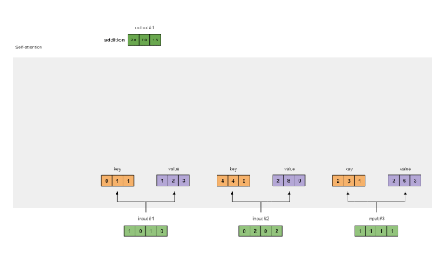
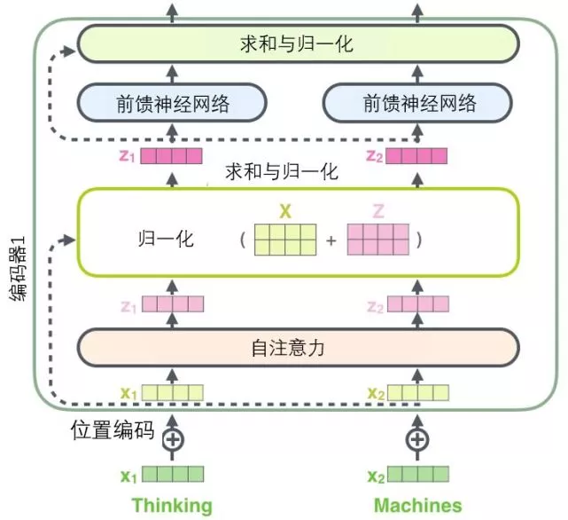
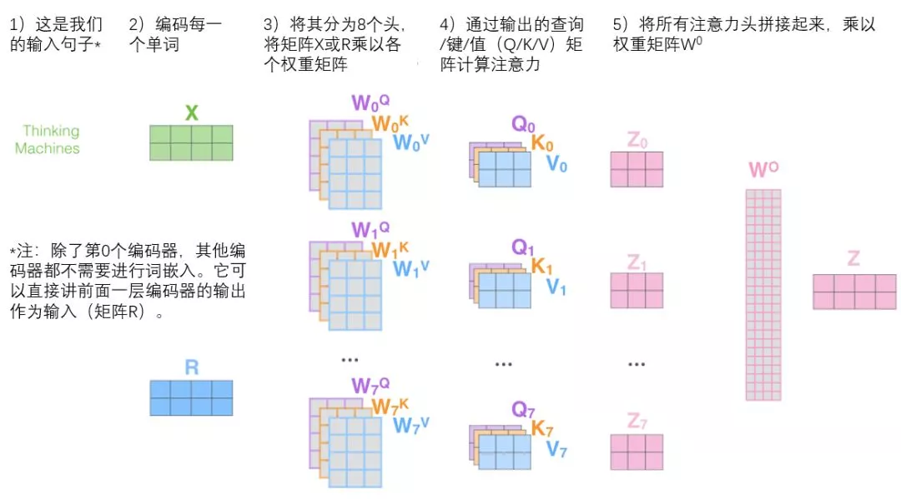

##### 相关文章

> [包学包会，这些动图和代码让你一次读懂「自注意力」](https://mp.weixin.qq.com/s/MuuOobNlvk-FAP9DRbuZEg)
> 
> [AI基础：图解Transformer](https://mp.weixin.qq.com/s/Stk37TdBYnF0eONXEI-6lQ)
> 
> [What is a Transformer?](https://medium.com/inside-machine-learning/what-is-a-transformer-d07dd1fbec04)

##### 组成模块

- [self-attention](https://mp.weixin.qq.com/s/MuuOobNlvk-FAP9DRbuZEg)

> 

[transformer](https://medium.com/inside-machine-learning/what-is-a-transformer-d07dd1fbec04)

- encode

> 

- multi-header

> 

- 
