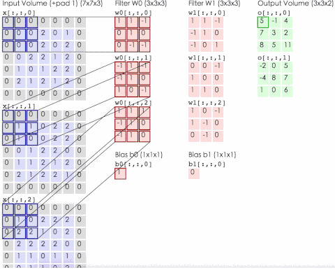
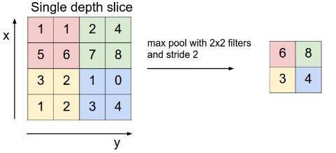
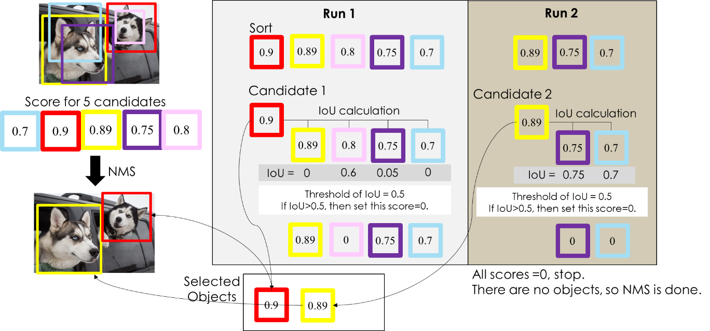

## 基本概念

###### 卷积

- [多输入多输出的卷积过程](http://cs231n.github.io/convolutional-networks/#conv)



> 当输入数据含多个通道时，我们需要构造一个与输入数据通道数相同的卷积核， 从而能够与含多通道的输入数据做互相关运算，得到一个输出通道的值；多个输出通道是多个卷积核与输入数据运算的结果。

- 特征图

> 二维卷积层输出的二维数组可以看作是输入在空间维度（宽和高）上某一级的表征，也叫特征图（feature map）

- 连接，指不同层之间通过权重关联起来

> 当前层的连接数=该层特征图大小*通道数*（卷积核数量*卷积核大小^2+1）

- [参数量的计算](https://datascience.stackexchange.com/questions/17064/number-of-parameters-for-convolution-layers)=(输出通道数*（输入通道数*卷积核大小^2 + 1）)

> 局部连接；权值共享

###### 池化



> mean-pooling(平均值池化)，bp时将残差等比例传至上一层计算
> max-pooling(最大值池化)，独立变量记录fp时的最大值位置，bp时残差传至上一层的最大值位置处，其他位置为0

###### 感受野

> 影响元素x的前向计算的所有可能输入区域 （可能大于输入的实际尺寸）叫做 x 的感受野（receptive field）

###### [激活函数](https://en.wikipedia.org/wiki/Activation_function)


- 作用：增强网络的表大能力

- ReLU的优点

> 计算简单，没有sigmoid中的求幂运算；
> 模型更易训练，正值域的梯度恒为1；

- sigmoid

> 缺点：函数值接近0或1，梯度几乎为0，造成bp时梯度消失，无法更新模型参数
> 
> 由于数据稳定性原因，以e为低的指数函数中指数值超过709时会溢出，所以需要限定指数的大小。
> 
> ```
> MAX_EXP = 709
> def sigmoid(x):
>     x = np.clip(x, -MAX_EXP, None) #限定x的下边界(-MAX_EXP, )
>     return 1 / (1 + np.exp(-x))
> ```

- softmax

> 该函数通常用于网络的输出层，用来将网络层的输出(logits)变为概率的形式，且各概率值的和相加等于1。
> 
> ---
> 
> softmax，就是soft版本的max，它在很多地方用的上。因为 hard 版本的 max 好是好，但是有很严重的梯度问题，求最大值这个函数本身的梯度是非常非常稀疏的（比如神经网络中的 max pooling），经过hardmax之后，只有被选中的那个变量上面才有梯度，其他都是没有梯度。这对于一些任务（比如文本生成等）来说几乎是不可接受的。所以要么用 hard max 的变种，比如 Gumbel或是 ARSM，要么直接用softmax。——来自[这里](https://www.zhihu.com/question/294679135)(ps： 和SVM中硬间隔和软间隔的出现一样，都是为了解决某种问题提出的替代方案。)
> 
> ---
> 
> 实际使用中，为防止指数运算时数据溢出(float64类型的上界为10<sup>308</sup>，e为底数时，指数的最大值为709)，对每个指数结果乘以常数C来减小其结果，通常选择log(C)=-max(x<sub>i</sub>) 
> 
> $$
> p_{i}=\frac{e^{x_{i}}}{\sum_{j=1}^{N}e^{x_{j}}}\newline
>  =\frac{Ce^{x_{i}}}{C\sum_{j=1}^{N}e^{x_{j}}} \newline
>  =\frac{e^{x_{i}+log(C)}}{\sum_{j=1}^{N}e^{x_{j}+log(C)}} \newline s.t. log(C)=-max(x_{i})
> $$
> 
> ```
> def softmax(x):
>     exp_x = np.exp(x - np.max(x))
>     return exp_x / exp_x.sum()
> ```
> 
> [softmax的微分](https://deepnotes.io/softmax-crossentropy)
> 
> pass

###### 损失函数

- [交叉熵损失函数](https://zhanghuimeng.github.io/post/why-we-should-compute-sigmoid-and-softmax-with-cross-entropy/)

> $$
> L=-\sum_{i=1}^{n}y_{i}log\hat{y}_{i}
> $$
> 
> 其中**y<sub>i</sub>表示第i个样本的one-hot向量，y<sup>^</sup> <sub>i</sub>表示该样本预测的类别概率值**(由sigmoid或softmax计算的概率值，数学上可以保证该概率值位于(0,1)间，但是计算机的表示范围有限，可能出现0的情况，导致上式直接溢出变成nan，所以需要对y<sup>^</sup><sub>i</sub>概率的上下界进行调整，通常使用很小的数ε表示0，则1相应的表示为1-ε)。
> 
> 由于计算中会设计到数值稳定性问题，故将激活函数和交叉熵损失函数进行合并，在一个公式中进行运算
> 
> ```
> EPS = 1e-9
> def cross_entropy(y, y_hat):
>  y_hat = np.clip(y_hat, EPS, 1-EPS) #限定y_hat上下界
>  return -np.sum(y * np.log(y_hat))
> ```
> 
> 1. softmax+cross entropy
>    将softmax公式代入cross entropy可得如下计算公式。
>    
>    $$
>    L=-\sum_{i=1}^{n}y_{i}log\hat{y}_{i}\newline
>    =-\sum_{i=1}^{n}y_{i}log\frac{e^{x_{i}}}{\sum_{j=1}^{n}e^{x_{j}}} \newline
>    = -\sum_{i=1}^{n}y_{i}(x_{i}-log\sum_{j=1}^{n}e^{x_{j}})\newline
>    = -\sum_{i=1}^{n}y_{i}x_{i} + \sum_{i=1}^{n}y_{i}log\sum_{j=1}^{n}e^{x_{j}}
>    $$

> 由于指数函数的数据稳定性问题，所以需要对其做如下处理。
> 
> $$
> log\sum_{i=1}^{n}e^{x_{i}}=log(e^{\alpha }\sum_{i=1}^{n}e^{x_{i}-\alpha }) \newline =\alpha +log(\sum_{i=1}^{n}e^{x_{i}-\alpha }) \newline s.t. :\alpha =max(x_{i})
> $$
> 
> ```
> def softmax_cross_entropy(x, y):
>  max_x = np.max(x)
>  log_exp = max_x + np.log(np.sum(np.exp(x - max_x)))
>  return -np.sum(x * y) + np.sum(y) * log_exp
> ```
> 
> 2. sigmoid+cross entropy
>    将sigmoid公式代入cross entropy，可得如下公式。
> 
> $$
> L=-\sum_{i=1}^{n}y_{i}log\hat{y}_{i}\newline
>  =-\sum_{i=1}^{n}y_{i}log\frac{1}{1+e^{-x_{i}}} \newline
> =\sum_{i=1}^{n}y_{i}log(1+e^{-x_{i}})
> $$
> 
> 当e<sup>-x<sub>i</sub></sup>数值较大时，可能溢出，此时用-x<sub>i</sub>替代log(1+e<sup>-x<sub>i</sub></sup>)。  
> 
> ```
> MAX_EXP = 709
> def sigmoid_cross_entropy(x, y):
>  for xi in np.nditer(x, op_flags=['readwrite']):
>  if xi < -MAX_EXP:
>    xi[...] = -xi
>  else:
>    xi[...] = math.log(1 + math.exp(-xi))
>  return np.sum(y * x)
> ```
> 
> 3. softmax/sigmoid + cross entropy合并处理后效果更好，因为分阶段处理时(先计算概率值，然后计算损失)，由于计算机精度的原因，概率小的值会舍入到0，然后增大到设定的值EPS，所以交叉熵中取对数后值变小了。单个样本的示例如下，多个样本的示例见[这里](https://stackoverflow.com/questions/34240703/what-is-logits-softmax-and-softmax-cross-entropy-with-logits)
> 
> ```
> import numpy as np
> from scipy.special import expit
> import math
> EPS = 1e-9
> MAX_EXP = 709
> 
> def softmax(x):
>     exp_x = np.exp(x - np.max(x))
>     return exp_x / exp_x.sum()
> 
> def sigmoid(x):
>     x = np.clip(x, -MAX_EXP, None)
>     return 1 / (1 + np.exp(-x))
> 
> def cross_entropy(y, y_hat):
>     y_hat = np.clip(y_hat, EPS, 1-EPS)
>     return -np.sum(y * np.log(y_hat))
> 
> def softmax_cross_entropy(x, y):
>     max_x = np.max(x)
>     log_exp = max_x + np.log(np.sum(np.exp(x - max_x)))
>     return -np.sum(x * y) + np.sum(y) * log_exp
> 
> def sigmoid_cross_entropy(x, y):
>     for xi in np.nditer(x, op_flags=['readwrite']):
>         if xi < -MAX_EXP:
>             xi[...] = -xi
>         else:
>             xi[...] = math.log(1 + math.exp(-xi))
>     return np.sum(y * x)
> 
> 
> x = np.array([1, 1, 1, 4000])
> y = np.array([1, 0, 0, 0])
> print(softmax(x))
> print(cross_entropy(y, softmax(x)))
> print(softmax_cross_entropy(x, y))
> >> outputs:
> >> [0. 0. 0. 1.]
> >> 20.72326583694641
> >> 3999.0
> 
> x = np.array([1, 1, -4000, -4000])
> y = np.array([0, 0, 0, 1])
> print(sigmoid(x))
> print(expit(x))
> print(cross_entropy(y, sigmoid(x)))
> print(cross_entropy(y, expit(x)))
> print(sigmoid_cross_entropy(x, y))
> >> outputs:
> >> [7.31058579e-001 7.31058579e-001 1.21678075e-308 1.21678075e-308]
> >> [0.73105858 0.73105858 0.         0.        ]
> >> 20.72326583694641
> >> 20.72326583694641
> >> 4000
> ```

###### [NMS](https://medium.com/@chih.sheng.huang821/%E6%A9%9F%E5%99%A8-%E6%B7%B1%E5%BA%A6%E5%AD%B8%E7%BF%92-%E7%89%A9%E4%BB%B6%E5%81%B5%E6%B8%AC-non-maximum-suppression-nms-aa70c45adffa)



### 网络模块及作用

#### 识别领域

- 1*1卷积

- DropOut

- [Batch Normalization](https://zh.d2l.ai/chapter_convolutional-neural-networks/batch-norm.html)
1. 出发点

> 深层神经网络中即使输入数据已做标准化，训练中模型参数的更新依然很容易造成靠近输出层输出的剧烈变化。 这种计算数值的不稳定性通常令我们难以训练出有效的深度模型。

2. 作用

> 标准化处理输入数据使各个特征的分布相近，这往往更容易训练出有效的模型；
> BN层使深层神经网络的训练变得更加容易;
>  BN利用小批量上的均值和标准差，不断调整神经网络中间输出，从而使整个神经网络在各层的中间输出的数值更稳定。

3. 操作。训练阶段：batch设得大一点，从而使批量内样本的均值和方差的计算都较为准确;预测阶段：通过移动平均估算整个训练数据集的样本均值和方差，并在预测时使用它们得到确定的输出。

> 应用于激活函数之前；
> 对Conv层的每个通道分别做批量归一化，且每个通道都拥有独立的拉伸和偏移参数，并均为标量。

4. 由于归一化参数不同，导致BN层的训练和预测时的计算结果也是不一样的。预测时通过移动平均估算整个训练数据集的样本均值和方差，并在预测时使用它们得到确定的输出

#### 检测领域

- high-res classifier
- high-res detector
- multi-scale
- passthrough，类似skip architecture
- anchor boxes
- residual blocks
- skip connections 
- upsampling

### 创新网络

#### [识别网络](https://zh.d2l.ai/chapter_convolutional-neural-networks/index.html)

- LeNet卷积神经网络

> 第一个卷积层输出通道数为6，第二个卷积层输出通道数则增加到16。这是因为第二个卷积层比第一个卷积层的输入的高和宽要小，增加输出通道使两个卷积层的参数尺寸类似

- AlexNet深度卷积神经网络

> 它首次证明了学习到的特征可以超越手工设计的特征

- VGG重复元素的网络

> 两个3\*3卷积核的感受野和1个5\*5卷积核的感受野相同，且参数减少；
> 通过使卷积核大小减半以及通道翻倍的设计，使得多数卷积层都有相同的模型参数尺寸和计算复杂度

- NIN网络中的网络

> 去除了容易造成过拟合的全连接输出层,将其替换成输出通道数等于标签类别数的NiN块和全局平均池化层;
> 重复使用由卷积层和代替全连接层的1×1卷积层构成的NiN块来构建深层网络;

- Inception并行连接的网络

> 它通过不同窗口形状的卷积层和最大池化层来并行抽取信息;
> 使用1×1卷积层减少通道数从而降低模型复杂度;
> Inception块的通道数分配之比是在ImageNet数据集上通过大量的实验得来的;

- ResNet残差网络
1. 出发点

> 对神经网络添加新层后，理论上，原模型解的空间只是新模型解的空间的子空间。 因此添加层似乎更容易降低训练误差。实际上，即使加入BN处理， 添加过多的层后训练误差往往不降反升。

2. 作用

> 在残差块中，输入可通过跨层的数据线路更快地向前传播。
> 残差映射在实际中往往更容易优化;

3. 操作

> 将浅层的数据与深层的数据相加

- DenseNet稠密连接网络
1. 出发点

> 靠近输入层与输出层之间的地方使用短连接（shorter_connections），就可以训练更深、更准确、更有效的卷积网络。

2. 组成模块：过渡层（transition layer)和稠密块（dense block）

> 稠密块定义了输入和输出是如何连结的。卷积块的通道数控制了输出通道数相对于输入通道数的增长，因此也被称为增长率（growth rate）;
> 过渡层用来控制通道数，使之不过大。通过 1×1 卷积层来减小通道数，使用步幅为2的平均池化层减半高和宽；

3. 与ResNet的差别是，ResNet跨层连接时使用相加的处理，DenseNet跨层连接时使用连结的处理逻辑
4. 优点

> 缓解梯度消失问题;
> 加强特征传播;
> 鼓励特征复用;
> 极大的减少了参数量;

5. 缺点:训练时十分消耗内存

> 运算需要，如对于大多数框架（如Torch和TensorFlow），每次拼接操作都会开辟新的内存来保存拼接后的特征；
> 一个 L 层的网络，要消耗相当 于L(L+1)/2层网络的内存（第 l 层的输出在内存里被存了 (L-l+1) 份


