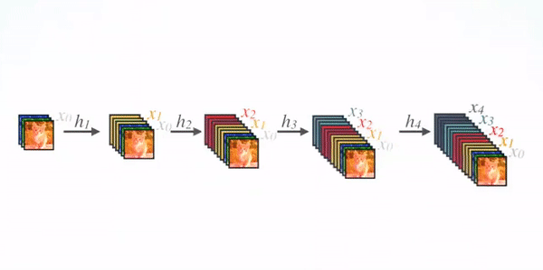
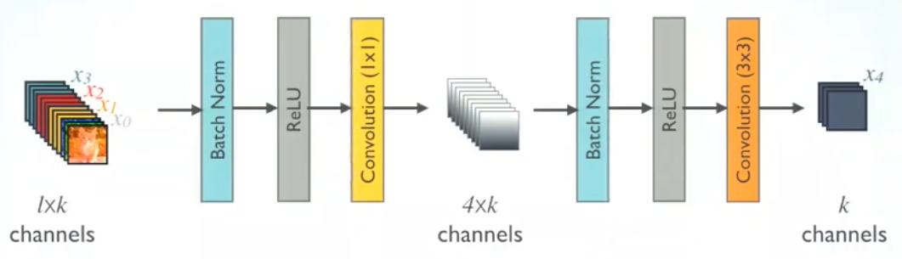

##### 网络

[DenseNet](https://towardsdatascience.com/review-densenet-image-classification-b6631a8ef803)

- 主要贡献

> 1. 更易训练(梯度更容易传播)；
> 
> 2. 更加丰富的特征(每层特征融合之前所有层的特征；每层特征还包括了浅层特征)；
> 
> 3. 更少的参数量；

- 主要模块

> 1. 基础Dense模块。对前一层特征图经过BN、RELU和3\*3卷积后得到当前层的结果，然后将前一层的特征图级联到当前层中；
> 
> 
> 
> 2. 带bottleneck层的Dense模块。为减少计算量，增加了1\*1的卷积。
> 
> 
> 
> 3. Dense模块间的转移层。用于降低特征图分辨率。
> 
> 
