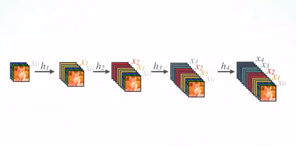

### 卷积

###### 参考资料

> [Understanding Memory Formats](https://intel.github.io/mkl-dnn/understanding_memory_formats.html)
> 
> [A guide to convolution arithmetic for deep learning](https://arxiv.org/abs/1603.07285)
> 
>  [A Comprehensive Introduction to Different Types of Convolutions in Deep Learning](https://towardsdatascience.com/a-comprehensive-introduction-to-different-types-of-convolutions-in-deep-learning-669281e58215)
> 
> [Convolutional Neural Networks](https://towardsdatascience.com/applied-deep-learning-part-4-convolutional-neural-networks-584bc134c1e2)
> 
> [A Basic Introduction to Separable Convolutions](https://towardsdatascience.com/a-basic-introduction-to-separable-convolutions-b99ec3102728)
> 
> [cs231n\_convolution](http://cs231n.github.io/convolutional-networks/#conv)
> 
> [CNN_Architectures_cs231n_2017_lecture9.pdf](http://cs231n.stanford.edu/slides/2017/cs231n_2017_lecture9.pdf)
> 
> [Intuitively Understanding Convolutions for Deep Learning](https://towardsdatascience.com/intuitively-understanding-convolutions-for-deep-learning-1f6f42faee1)
> 
> [如何理解空洞卷积（dilated convolution）？](https://www.zhihu.com/question/54149221)
> 
> [What's the use of dilated convolutions?](https://stackoverflow.com/questions/41178576/whats-the-use-of-dilated-convolutions)
> 
> [卷积神经网络中十大拍案叫绝的操作](https://cloud.tencent.com/developer/article/1038802)
> 
> [ A guide to receptive field arithmetic for Convolutional Neural Networks](https://medium.com/mlreview/a-guide-to-receptive-field-arithmetic-for-convolutional-neural-networks-e0f514068807)

###### 基础理解

- 作用：提取特征

- 特点：局部连接、权值共享

- 超参数:改变输出特征图的大小(输出的空间布局)

> padding（填充）: 0 padding(不填充), half(same) padding(保证输入与输出大小相同), full padding(p=k-1)
> stride（步幅）
> dilations（空洞值）

- 卷积的过程


- 多输入多输出的卷积过程，图片来自[这里](http://cs231n.github.io/convolutional-networks/#conv)。


> 当输入数据含多个通道时，我们需要构造一个与输入数据通道数相同的卷积核， 从而能够与含多通道的输入数据做互相关运算，得到一个输出通道的值；多个输出通道是多个卷积核与输入数据运算的结果。

- 感受野

> 影响元素x的前向计算的所有可能输入区域 （可能大于输入的实际尺寸）叫做 x 的感受野（receptive field）
> 
> 卷积神经网络每一层输出的特征图（feature map）上的像素点在原始图像上映射的区域大小

- 输出特征图大小与感受野计算

> K：卷积核大小
> 
> P：填充大小
> 
> S：移动步长
> 
> N：特征图大小
> 
> R：感受野大小
> 
> d：膨胀大小
> 
> J：相邻像素间的步长
> 
> - 卷积输出特征图大小，向上取整
> 
> $$
> N_{out} = \left \lfloor \frac {(N_{in} - K + 2P)}{S} \right \rfloor + 1
> $$
> 
> - 卷积感受野大小 
> 
> $$
> R_{0} = K \newline
> J_{0} = S \newline
> R_{out}=R_{in} + (K-1)*J_{in} \newline
> J_{out}=J_{in}*S
> 
> $$
> 
> - 空洞卷积的输出特征图大小
> 
> $$
> N_{out} = \left \lfloor \frac {(N_{in} - d(K - 1) - 1 + 2P)}{S} \right \rfloor + 1
> $$
> 
> - 空洞卷积的感受野大小
> 
> $$
> R_{i}=R_{i-1} + d*(K-1)* \prod_{n=1}^{i-1} S_{n}
> $$

- 特征图、感受野、第一个输出特征的感受野的中心位置，图片来自[这里](https://medium.com/mlreview/a-guide-to-receptive-field-arithmetic-for-convolutional-neural-networks-e0f514068807)


- [deconvolution](https://www.zhihu.com/question/43609045)别名transposed convolution, backward convolution, fractally strided convolution, upsampling convolution，并不是指信号处理中还原输入信号的反卷积。深度学习中的转置卷积主要用来上采样，应用于GAN网络或分割网络等。deconv和conv关系：conv是多对1，deconv是1对多；位置关联；转置卷积的权重是学出来的;转置卷积可以得到原来的图像大小，但实际使用中转置卷积核的大小无关紧要，因为转置卷积参数中有输出大小的参数
  
  > the actual weight values in the matrix does not have to come from the original convolution matrix. What’s important is that the weight layout is transposed from that of the convolution

###### 池化


                                                                        图片来自[这里](http://cs231n.github.io/convolutional-networks/#conv)

- 作用：增加网络对旋转和位移的鲁棒性

- 超参数

> padding（填充）
> stride（步幅）
> dilation_rate(空洞值)

- [分类及bp计算](http://www.voidcn.com/article/p-rbpamgzn-bee.html)

> average-pooling(平均值池化)，bp时将残差等比例传至上一层计算
> max-pooling(最大值池化)，独立变量记录fp时的最大值位置，bp时残差传至上一层的最大值位置处，其他位置为0
> 
> global-pooling (全局池化), 包括全局平均池化和全局最大化池化，旨在将整个特征图映射为1个值。

###### 卷积可视化

- 特点：以热量图的形式表示数值大小或正确分类的高低

- 分类：参数(滤波核)可视化和非参数(特征图)可视化

- 作用

> 观察特征图的响应。如ZFnet根据特征可视化，提出AlexNet第一个卷积层卷积核太大，导致提取到的特征模糊；
> 通过每层特征图的变化得到特征演变过程；
> 对分类器进行敏感性分析。可通过阻止部分输入图像揭示那部分对分类是重要的；
> 诊断模型潜在问题；

- [卷积核及特征图可视化参考代码](https://machinelearningmastery.com/how-to-visualize-filters-and-feature-maps-in-convolutional-neural-networks/)

##### 分类

**卷积核的4个超参数：输入特征图的通道数、滤波器的高度、滤波器的宽度和输出特征图的通道数**。不同类型的卷积及其计算量均是通过上述4个超参数间的组合变换得到的，其中计算量可看下图，图片来自[这里](https://medium.com/@yu4u/why-mobilenet-and-its-variants-e-g-shufflenet-are-fast-1c7048b9618d)。

###### 基础卷积

- 数据格式：NCHW和NHWC，在内存中的存储方式也不同。图片来自[这里](https://intel.github.io/mkl-dnn/understanding_memory_formats.html)。

> **N**: number of images in the batch
> 
> **H**: height of the image
> 
> **W**: width of the image
> 
> **C**: number of channels of the image (ex: 3 for RGB, 1 for grayscale...)
> 
> TensorFlow 为什么选择 NHWC 格式作为默认格式？因为早期开发都是基于 CPU，使用 NHWC 比 NCHW 稍快一些（不难理解，NHWC 局部性更好，cache 利用率高）。
> 
> NCHW 则是 Nvidia cuDNN 默认格式，使用 GPU 加速时用 NCHW 格式速度会更快（也有个别情况例外）。
> 
> 最佳实践：设计网络时充分考虑两种格式，最好能灵活切换，在 GPU 上训练时使用 NCHW 格式，在 CPU 上做预测时使用 NHWC 格式。


- [卷积运算的两种方式](http://www.jeepxie.net/article/1273916.html)：卷积核与特征图的互相关运算(Traditional convolution)；转换为矩阵相乘的运算(将特征图重叠地划分为多个子矩阵，对每个子矩阵序列化成向量，并根据数据格式组合成另一个矩阵)。在caffe中，卷积运算采用后者，即先对数据进行[img2col](http://www.jeepshoe.net/art/121249.html)操作，再进行內积运算，速度比原始卷积操作的速度更快。


- 标准卷积


                                                            图片来自[这里](https://github.com/vdumoulin/conv_arithmetic)

> 上图中蓝色为输入特征图，阴影部分为卷积核，绿色为卷积后的结果；
> 
> 卷积核格式类似于特征图数据格式，单个卷积核的大小为HWC，其中H和W为卷积核大小，C为输入特征图的通道数。卷积操作时将每个通道上卷积的结果相加作为输出特征图上对应位置的值。对于输出M个特征图时，需要M个HWC维度的卷积核分别卷积。

- [转置卷积(deconvolution, fractionally strided convolutions)](https://medium.com/activating-robotic-minds/up-sampling-with-transposed-convolution-9ae4f2df52d0)

| 原始卷积                                         | 反卷积                                      |
|:--------------------------------------------:|:----------------------------------------:|
|  |  |

                                                           图片来自[这里](https://github.com/vdumoulin/conv_arithmetic)

> 利用卷积运算的第二种形式来理解转置卷积名称的由来。上图为一组卷积与转置卷积的对应关系。卷积核将输入中的9个值与输出中的1个值联系起来；转置卷积将输入中的单个特征与输出中的多个特征联系起来。卷积运算时，将输入特征图变为16\*1的列向量，卷积核转变为4\*16的矩阵，则输出为4\*1的列向量，转变为2\*2的矩阵。deconvolution时，将2\*2的输入矩阵变为4\*1的列向量，则卷积核转变为16\*4的矩阵，运算后得到16\*1的列向量，即原输入特征图4\*4的大小。所以**卷积和deconvolution操作时，卷积核大小呈现出转置的关系**，ps:转置卷积核也是学出来的，数据上与原卷积核无关。
> 
> **卷积与转置卷积输出特征图的大小与输入特征图大小，卷积核大小、步长和填充大小的关系相同**。且转置卷积的步长始终为1，由于卷积核大小相同，故可以根据输出特征图大小的关系，计算出转置卷积零填充的大小。当原卷积步长为1时，对应转置卷积的参数为：k'=k, s'=1, p'=k-p-1;原卷积步长大于1时，对应转置卷积的步长小于1，此时需要在转置卷积输入特征图的相邻特征间填充(s-1)个零元素得到转置卷积变换后的输入特征图(故也将转置卷积称为**fractionally strided convolutions**)，此时转置卷积的步长重新变为1，即原卷积步长为s时，对应转置卷积输入特征图大小变为i'+(i'-1)(s-1)，参数为：k'=k, s'=1, p'=k-p-1。如上操作建立在原卷积操作中特征图大小i与其卷积参数的关系为i+2p-k是s的整数倍的前提下，若不能整除则原始卷积中右侧和下侧的填充区域不参与卷积运算，此时也需要对转置卷积输入特征图的右侧和下侧添加(i+2p-k)mod(s)个零填充。如i=6, k=3,s=2,p=1时无法整除。此时卷积与转置卷积如下图所示。
> 
> $$
> {o}'=s({i}'- 1)+a+k-2p \newline
> st. \: a=(i+2p−k) mod (s)
> $$
> 
> | 原卷积                               | 带额外填充区域的转置卷积                                 |
> | --------------------------------- | -------------------------------------------- |
> |  |  |

- [空洞卷积](http://blog.qure.ai/notes/semantic-segmentation-deep-learning-review#dilation)


                                                            图片来自[这里](https://github.com/vdumoulin/conv_arithmetic)

>  [Dilated convolutional layer](http://blog.qure.ai/notes/semantic-segmentation-deep-learning-review#dilation) (also called as atrous convolution in [DeepLab](http://blog.qure.ai/notes/semantic-segmentation-deep-learning-review#deeplab)) allows for exponential increase in field of view without decrease of spatial dimensions.(空洞卷积的感受野程指数级增加，且不会减小特征图的空间大小)
> 
> “Atrous”源自法语“à trous”，意思是带孔。
> 
> **空洞卷积与转置卷积的差异**：
> 
> 1. 空洞卷积是为了增大感受野；转置卷积是为了upsampling;
> 
> 2. 空洞卷积的**dilation rate**相对于卷积核而言；转置卷积的stretch是对输入特征图处理的；

- 可变形卷积


> [可变性卷积](https://towardsdatascience.com/review-dcn-deformable-convolutional-networks-2nd-runner-up-in-2017-coco-detection-object-14e488efce44)用于解决具有复杂几何形变物体的特征提取。这主要是通过对卷积神经网络引入学习空间几何形变的能力来实现的，如物体的尺度变换、比例变换和旋转变换等。具体的如上图左侧，通过对输入特征图(共N个)的每个通道进行卷积获得2N个(x和y方向)对应输入位置偏移量的特征图；池化操作时先进行常规池化处理，得到输出特征图，如右图上侧，然后利用全连接层输出k\*k\*2*N个值，分别对应标准池化后每个点的偏移量。
> 
> **与空洞卷积的差异**：空洞卷积的空洞值是固定的，且卷积核中相邻元素间的空洞值相同；可变性卷积的空洞值是学出来的，卷积核中相邻元素的空洞值是变化的。
> 
> **与Spatial Transformer Network(STN)的差异**：[STN](https://towardsdatascience.com/review-stn-spatial-transformer-network-image-classification-d3cbd98a70aa)应用的对象为特征图或卷积核；可变性卷积应用的对象为卷积核，可看作轻量级的STN。

- 点卷积


                                                            图片来自[这里](https://towardsdatascience.com/a-basic-introduction-to-separable-convolutions-b99ec3102728)

> 输入输出特征数不同。利用 1*1的卷积核对不同通道的特征图进行组合的操作，增加特征的非线性表达。用来实现输入输出通道数的改变，用于bottleneck结构、inception结构、深度可分离卷积结构等。

- 深度卷积


                                                    图片来自[这里](https://medium.com/@chih.sheng.huang821/%E6%B7%B1%E5%BA%A6%E5%AD%B8%E7%BF%92-mobilenet-depthwise-separable-convolution-f1ed016b3467)

> 输入输出通道数相同。对输入特征图的每个通道分别进行卷积，得到输出特征图对应通道上的结果。

- 卷积核因式分解


> InceptionV2中对卷积核的分解进行了讨论，将V1中的5\*5卷积替换为V2版本中的两个3\*3的卷积，并进一步探讨是否可进一步分解：如使用2\*2的卷积。论文中指出非对称的卷积n\*1和1\*n组合的效果比2\*2的效果好，且上图中两个非对称卷积感受野与3\*3卷积核的感受野相同。
> 
> 同时论文指出，非对称卷积在模型的低层特征图中效果较差，中层特征图(特征图大小为between 12 and 20)中效果不错。

- 分组卷积


                                                        图片来自[这里](https://towardsdatascience.com/a-comprehensive-introduction-to-different-types-of-convolutions-in-deep-learning-669281e58215)

> 分组卷积主要应用于早期计算资源受限的情况下，无法在一个GPU上进行模型的训练，故将其划分不同的组合分别进行卷积运算。即通过分组的方式减少计算量。

- 通道shuffle卷积


                                                图片来自[这里](https://towardsdatascience.com/a-comprehensive-introduction-to-different-types-of-convolutions-in-deep-learning-669281e58215)

> 目的：混合来自不同滤波器的特征值。针对利用分组卷积时，特征仅来自上层组内的特征图的问题，通过将通道混合，增强特征表达力。

###### 组合卷积

- bottleneck层

| inceptionn                                    | resnet                                     |
|:---------------------------------------------:|:------------------------------------------:|
|  |  |

                                                                图片来自[这里](http://cs231n.stanford.edu/slides/2017/cs231n_2017_lecture9.pdf)

> 输入层具有较大的通道数(如上右侧256个)，经过1\*1的卷积后输出通道数大大减少(如上右侧64个)，通道参数的变化类似瓶颈，故称之为bottleneck层。bottleneck层是为了减少参数量。

- 深度可分离卷积


                                                            图片来自[这里](https://medium.com/@chih.sheng.huang821/%E6%B7%B1%E5%BA%A6%E5%AD%B8%E7%BF%92-mobilenet-depthwise-separable-convolution-f1ed016b3467)

> Depthwise separable convolution将标准卷积在一个阶段完成的操作分为两步来完成：先进行深度卷积，再进行点卷积。大大降低了模型的计算量(约为标准卷积计算量的1/k<sup>2</sup>)，
> 
> $$
> \frac{calculation(depthwise seperable convolution)}{calculation(standard convolution)}= \frac{W\cdot H\cdot N_{in}\cdot K\cdot K + W\cdot H\cdot N_{in}\cdot N_{out}}{W\cdot H\cdot N_{in}\cdot K\cdot K\cdot N_{out}} \newline
> = \frac{1}{N_{out}} + \frac{1}{K\cdot K}\approx \frac{1}{K\cdot K}
> $$

###### 卷积+运算

- [inception](https://towardsdatascience.com/a-simple-guide-to-the-versions-of-the-inception-network-7fc52b863202)


                                                            图片来自[这里](http://cs231n.stanford.edu/slides/2017/cs231n_2017_lecture9.pdf)

> 设计初衷是希望在同一层使用不同大小的卷积核进行运算 。原因有如下几方面。
> 
> 1. 图像中显著性区域的占比不同；
> 
> 2. 全局信息适合采用大的卷积核，局部信息则利用小的卷积核；
> 
> 3. 深层网络容易过拟合，且不易训练(resnet之前)；
> 
> 4. 堆叠大卷积核时计算量很大。
> - V1版本按照上述初衷进行实现，为减少计算量加入了1\*1的卷积。ps 最右侧的1\*1卷积位于池化操作后。
> 
> - V2和V3版本在同一篇[论文](https://arxiv.org/pdf/1512.00567v3.pdf)中，其中V2版本主要是对V1版本中的卷积核进行分解：5\*5的卷积核分解为2个3\*3的卷积核; 将1个3\*3的卷积核分解为1\*3和3\*1的两个卷积核；为了增加inception的宽度，将叠加的1\*3和3\*1的卷积进行并行的处理。探讨了进一步分解为更小卷积核的可能，结果发现非对称卷积1\*n和n\*1卷积的效果比2\*2卷积核的效果好，且非对称卷积只对特定大小的特征图有较好的效果：对特征图为12到20的大小时效果较好，此时n=7；对特征图大小为35、17和8的三种情况分别设计了Model A，Model B和Model C进行处理。V3在V2实验基础上增加了7\*7卷积核的分解；辅助分类分支仅在网络训练的最后阶段起作用(即准确率接近饱和时)，其作用相当于对网络增加了正则项，尤其是增加BatchNorm或DropOut后;对损失函数增加正则部分，减小网络分类的置信度，防止过拟合。
>   
>   1. RMSProp Optimizer.
>   
>   2. Factorized 7x7 convolutions.
>   
>   3. BatchNorm in the Auxillary Classifiers.
>   
>   4. Label Smoothing (A type of regularizing component added to the loss formula that prevents the network from becoming too confident about a class. Prevents over fitting).
> 
> - V4和Inception-ResnetV1,V2版本出现在同一篇[论文](https://arxiv.org/pdf/1602.07261.pdf)。之前版本中网络的主干部分(论文中指i使用inception前)各不相同，且较为复杂。V4版本旨在对该主干部分进行统一，且使用类似V2中的Model A,B,C用于该版本中，另外增加了两个改变特征图大小的reduction 模块，分别将特征图从35降为17和从17降为8的inception模块。计算量方面，Inception-ResnetV1与InceptionV3接近，Inception-ResnetV2与InceptionV4接近；主干网方面，InceptionV4与Inception-ResnetV2的相同，与Inception-ResnetV1的不同；Inception方面，InceptionV4与Inception-ResnetV1,V2均使用了Model ABC和Reduction模块，只是参数不同，Inception-Resnet中ModelABC模块均去除了池化部分并且在输出部分增加了1\*1卷积，且同一版本中存在基于Recudtion不同的smaller和wider版本。
> 
> | V4 Model ABC                                          | V4 Reduction Model                                          |
> |:-----------------------------------------------------:|:-----------------------------------------------------------:|
> |         |         |
> | inception-resnetV1 Model ABC                          | inception-resnetV1 Reduction Model                          |
> |  |  |

- 残差模块


> 残差模块名称的由来：一般的通过网络学习输入x与输出H(x)的映射关系，残差网络中旨在学习输入x和网络的部分输出f(x)与输出H(x)的映射关系，由于x为恒等映射，故残差网络实际学习的是H(x)-x部分的映射关系，即残差部分。
> 
> 加入bottleneck结构(上图右侧)是为了减少训练时间。

- 反残差模块


> 形状上：残差模块形状为两头大，中间小。反残差模块形状为两头小，中间大；
> 
> 设计依据：
> 
> 1. 网络的特征图可以在低维空间(通道数)进行编码；
> 
> 2. RELU激活函数会导致低维特征的信息损失。
> 
> **feature maps** are able to be encoded in low-dimensional subspaces；
> 
> **non-linear activations** result in information loss in spite of their ability to increase representational complexity

- [稠密卷积](https://towardsdatascience.com/review-densenet-image-classification-b6631a8ef803)



>  **原始稠密卷积**：将输入经过BN、线性激活和卷积后得到卷积结果，并将其与输入部分级联后得到稠密卷积的输出；
> 
> 
> 
> **增加bottleneck后的稠密卷积**：在原始卷积前增加了bottleneck模块；
> 
> 该模块与残差模块不同之处见下图。
> 
> 

###### 参考代码

- [可分离卷积](https://github.com/tensorflow/tensorflow/blob/r2.0/tensorflow/contrib/layers/python/layers/layers.py)

```
def separable_convolution2d(
    inputs,
    num_outputs,
    kernel_size,
    depth_multiplier=1,
    stride=1,
    padding='SAME',
    data_format=DATA_FORMAT_NHWC,
    rate=1,
    activation_fn=nn.relu,
    normalizer_fn=None,
    normalizer_params=None,
    weights_initializer=initializers.xavier_initializer(),
    pointwise_initializer=None,
    weights_regularizer=None,
    biases_initializer=init_ops.zeros_initializer(),
    biases_regularizer=None,
    reuse=None,
    variables_collections=None,
    outputs_collections=None,
    trainable=True,
    scope=None):
  """Adds a depth-separable 2D convolution with optional batch_norm layer.
  This op first performs a depthwise convolution that acts separately on
  channels, creating a variable called `depthwise_weights`. If `num_outputs`
  is not None, it adds a pointwise convolution that mixes channels, creating a
  variable called `pointwise_weights`. Then, if `normalizer_fn` is None,
  it adds bias to the result, creating a variable called 'biases', otherwise,
  the `normalizer_fn` is applied. It finally applies an activation function
  to produce the end result.
  Args:
    inputs: A tensor of size [batch_size, height, width, channels].
    num_outputs: The number of pointwise convolution output filters. If is None,
      then we skip the pointwise convolution stage.
    kernel_size: A list of length 2: [kernel_height, kernel_width] of of the
      filters. Can be an int if both values are the same.
    depth_multiplier: The number of depthwise convolution output channels for
      each input channel. The total number of depthwise convolution output
      channels will be equal to `num_filters_in * depth_multiplier`.
    stride: A list of length 2: [stride_height, stride_width], specifying the
      depthwise convolution stride. Can be an int if both strides are the same.
    padding: One of 'VALID' or 'SAME'.
    data_format: A string. `NHWC` (default) and `NCHW` are supported.
    rate: A list of length 2: [rate_height, rate_width], specifying the dilation
      rates for atrous convolution. Can be an int if both rates are the same. If
      any value is larger than one, then both stride values need to be one.
    activation_fn: Activation function. The default value is a ReLU function.
      Explicitly set it to None to skip it and maintain a linear activation.
    normalizer_fn: Normalization function to use instead of `biases`. If
      `normalizer_fn` is provided then `biases_initializer` and
      `biases_regularizer` are ignored and `biases` are not created nor added.
      default set to None for no normalizer function
    normalizer_params: Normalization function parameters.
    weights_initializer: An initializer for the depthwise weights.
    pointwise_initializer: An initializer for the pointwise weights. default set
      to None, means use weights_initializer.
    weights_regularizer: Optional regularizer for the weights.
    biases_initializer: An initializer for the biases. If None skip biases.
    biases_regularizer: Optional regularizer for the biases.
    reuse: Whether or not the layer and its variables should be reused. To be
      able to reuse the layer scope must be given.
    variables_collections: Optional list of collections for all the variables or
      a dictionary containing a different list of collection per variable.
    outputs_collections: Collection to add the outputs.
    trainable: Whether or not the variables should be trainable or not.
    scope: Optional scope for variable_scope.
  Returns:
    A `Tensor` representing the output of the operation.
  Raises:
    ValueError: If `data_format` is invalid.
  """
  if data_format not in (DATA_FORMAT_NCHW, DATA_FORMAT_NHWC):
    raise ValueError('data_format has to be either NCHW or NHWC.')
  layer_variable_getter = _build_variable_getter({
      'bias': 'biases',
      'depthwise_kernel': 'depthwise_weights',
      'pointwise_kernel': 'pointwise_weights'
  })

  with variable_scope.variable_scope(
      scope,
      'SeparableConv2d', [inputs],
      reuse=reuse,
      custom_getter=layer_variable_getter) as sc:
    inputs = ops.convert_to_tensor(inputs)

    if pointwise_initializer is None:
      pointwise_initializer = weights_initializer

    df = ('channels_first'
          if data_format and data_format.startswith('NC') else 'channels_last')
    if num_outputs is not None:
      # Apply separable conv using the SeparableConvolution2D layer.
      layer = convolutional_layers.SeparableConvolution2D(
          filters=num_outputs,
          kernel_size=kernel_size,
          strides=stride,
          padding=padding,
          data_format=df,
          dilation_rate=utils.two_element_tuple(rate),
          activation=None,
          depth_multiplier=depth_multiplier,
          use_bias=not normalizer_fn and biases_initializer,
          depthwise_initializer=weights_initializer,
          pointwise_initializer=pointwise_initializer,
          bias_initializer=biases_initializer,
          depthwise_regularizer=weights_regularizer,
          pointwise_regularizer=weights_regularizer,
          bias_regularizer=biases_regularizer,
          activity_regularizer=None,
          trainable=trainable,
          name=sc.name,
          dtype=inputs.dtype.base_dtype,
          _scope=sc,
          _reuse=reuse)
      outputs = layer.apply(inputs)

      # Add variables to collections.
      _add_variable_to_collections(layer.depthwise_kernel,
                                   variables_collections, 'weights')
      _add_variable_to_collections(layer.pointwise_kernel,
                                   variables_collections, 'weights')
      if layer.bias is not None:
        _add_variable_to_collections(layer.bias, variables_collections,
                                     'biases')

      if normalizer_fn is not None:
        normalizer_params = normalizer_params or {}
        outputs = normalizer_fn(outputs, **normalizer_params)
    else:
      # Actually apply depthwise conv instead of separable conv.
      dtype = inputs.dtype.base_dtype
      kernel_h, kernel_w = utils.two_element_tuple(kernel_size)
      stride_h, stride_w = utils.two_element_tuple(stride)
      num_filters_in = utils.channel_dimension(
          inputs.get_shape(), df, min_rank=4)
      weights_collections = utils.get_variable_collections(
          variables_collections, 'weights')

      depthwise_shape = [kernel_h, kernel_w, num_filters_in, depth_multiplier]
      depthwise_weights = variables.model_variable(
          'depthwise_weights',
          shape=depthwise_shape,
          dtype=dtype,
          initializer=weights_initializer,
          regularizer=weights_regularizer,
          trainable=trainable,
          collections=weights_collections)
      strides = [
          1, 1, stride_h, stride_w
      ] if data_format.startswith('NC') else [1, stride_h, stride_w, 1]

      outputs = nn.depthwise_conv2d(
          inputs,
          depthwise_weights,
          strides,
          padding,
          rate=utils.two_element_tuple(rate),
          data_format=data_format)
      num_outputs = depth_multiplier * num_filters_in

      if normalizer_fn is not None:
        normalizer_params = normalizer_params or {}
        outputs = normalizer_fn(outputs, **normalizer_params)
      else:
        if biases_initializer is not None:
          biases_collections = utils.get_variable_collections(
              variables_collections, 'biases')
          biases = variables.model_variable(
              'biases',
              shape=[
                  num_outputs,
              ],
              dtype=dtype,
              initializer=biases_initializer,
              regularizer=biases_regularizer,
              trainable=trainable,
              collections=biases_collections)
          outputs = nn.bias_add(outputs, biases, data_format=data_format)

    if activation_fn is not None:
      outputs = activation_fn(outputs)
    return utils.collect_named_outputs(outputs_collections, sc.name, outputs)
```

- 深度可分离卷积([depthwise_separable_conv](https://github.com/Zehaos/MobileNet/blob/master/nets/mobilenet.py))

```
  def _depthwise_separable_conv(inputs,
                            num_pwc_filters,
                            width_multiplier,
                            sc,
                            downsample=False):
    """ Helper function to build the depth-wise separable convolution layer.
    """
    num_pwc_filters = round(num_pwc_filters * width_multiplier)
    _stride = 2 if downsample else 1

    # skip pointwise by setting num_outputs=None
    depthwise_conv = slim.separable_convolution2d(inputs,
                                                  num_outputs=None,
                                                  stride=_stride,
                                                  depth_multiplier=1,
                                                  kernel_size=[3, 3],
                                                  scope=sc+'/depthwise_conv')

    bn = slim.batch_norm(depthwise_conv, scope=sc+'/dw_batch_norm')
    pointwise_conv = slim.convolution2d(bn,
                                        num_pwc_filters,
                                        kernel_size=[1, 1],
                                        scope=sc+'/pointwise_conv')
    bn = slim.batch_norm(pointwise_conv, scope=sc+'/pw_batch_norm')
    return bn 
```
