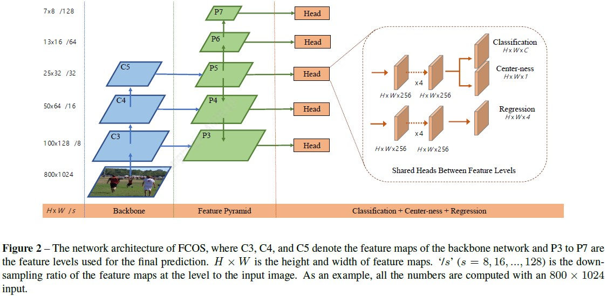

##### 文章

> [13 篇基于 Anchor free 的目标检测方法](http://bbs.cvmart.net/articles/442)

##### 模块

###### anchor

> - 缺点：
> 1. 在哪些层使用anchor(即anchor的大小，不同特征图上使用不同大小的anchor)、每个位置的anchor数量、anchor的宽高比参数等需要人工参与或聚类得到；
> 
> 2. 计算anchor与GT间IOU时的阈值参数；
> 
> 3. 参数值不具有通用性，不同任务各不相同；
> 
> 4. 基于anchor获得训练的正负样本大量失衡，计算IOU运算比较耗时；

###### [NMS](https://medium.com/@chih.sheng.huang821/%E6%A9%9F%E5%99%A8-%E6%B7%B1%E5%BA%A6%E5%AD%B8%E7%BF%92-%E7%89%A9%E4%BB%B6%E5%81%B5%E6%B8%AC-non-maximum-suppression-nms-aa70c45adffa)

[SmoothL1/IOU/GIOU/DIOU/CIOU loss](http://bbs.cvmart.net/topics/1436)

pass# 目标检测回归损失函数简介：SmoothL1/IoU/GIoU/DIoU/CIoU Loss

###### [FPN](https://medium.com/@jonathan_hui/understanding-feature-pyramid-networks-for-object-detection-fpn-45b227b9106c)

                                  图片来自[这里](https://medium.com/@jonathan_hui/understanding-feature-pyramid-networks-for-object-detection-fpn-45b227b9106c)——基于FPN骨干网的检测网络

> 缺点：FPN结构在高层的语义特征进行融合效果并不好，所以FCOS中P6和P7是由P5依次卷积得到，而不是从P7上采样然后融合自下向上的特征得到P6。
> 
> **FPN用于特征提取**，分**自下向上**和**自上向下**两个数据流。
> 
> 自下向上数据流：用于提取高层的语义特征，特征图的分辨率依次减小1/2；
> 
> 自上向下数据流：用于不同语义的预测，采用双线性插值的方法提高特征图分辨率；
> 
> 两个数据流的融合：除最小的特征图外，将自下向上数据流中的特征图通过1\*1的卷积核与自上向下数据流中的特征图相加。这是因为具有较强语义的特征图中物体的位置信息不准确，故将其与浅层特征进行融合。同时为消除融合过程中产生的混叠现象(棋盘格)，对融合后的特征利用3\*3的卷积核进行处理。
> 
> 整个处理流程如下。
> 
>  
> 
> **FPN+RPN**
> 
> pass

[Proposal Pooling](https://towardsdatascience.com/understanding-region-of-interest-part-2-roi-align-and-roi-warp-f795196fc193)

| ROIAlign & ROIPooling                        | ROIWarp                          |
| -------------------------------------------- | -------------------------------- |
|  |  |

> 三种池化的对比，从左到右以此为ROIAlign, ROIPooling, ROIWarp操作。其中**红框为ROI区域，橘色为实际池化区域，蓝色(包括浅蓝色)为池化时舍弃区域，绿色为池化时的额外区域**。

> 1. ROI Pooling。存在两次量化过程：坐标量化和等分区域的量化。
> 
> 
> 
> 2. ROI Warp。存在一次量化操作：坐标量化，区域内的值采用双线性插值的方法获得4个点的像素值；
> 
> 
> 
> 3. ROI Align。无量化操作。通过将ROI区域等分后，在每个小grid中再等分3份，即小box内共四个点，然后利用双线性插值的方法获得对应的像素值。
> 
> 

##### 不均衡问题

> 1. 类别不平衡：前景和背景不平衡、前景中不同类别输入包围框的个数不平衡；
> 2. 尺度不平衡：输入图像和包围框的尺度不平衡，不同特征层对最终结果贡献不平衡；
> 3. 空间不平衡：不同样本对回归损失的贡献不平衡、正样本IoU分布不平衡、目标在图像中的位置不平衡；
> 4. 目标函数不平衡：不同任务（比如回归和分类）对全局损失的贡献不平衡。

##### 网络

Faster-RCNN

                                                              图片来自[这里](https://medium.com/@jonathan_hui/understanding-feature-pyramid-networks-for-object-detection-fpn-45b227b9106c)

- 主要贡献

> 1. 提出用RPN生成候选区域
> 
> 2. 融合RPN至检测算法流程中，实现端到端训练
> 
> 3. 为其他算法提供参考框架

- 训练中的正负样本

- 问题及解决方法

> 1. proposal区域归一化问题

[YOLOV1](https://docs.google.com/presentation/d/1aeRvtKG21KHdD5lg6Hgyhx5rPq_ZOsGjG5rJ1HP7BbA/pub?start=false&loop=false&delayms=3000&slide=id.p)

- 训练中的正负样本

> 将GT坐标换算到网络输出层维度中(7\*7\*30)，然后根据网络预测值与当前分辨率下GT的坐标计算IOU，将其转换为当前预测值是否为物体的权重。具体的，首先初始化输出层所有位置[S\*S, B, 4]的坐标位置为0; 然后计算GT转换到7\*7输出层的中心点相对于栅格起点(中心点取整时的坐标)的偏移坐标和宽高归一化值；接着根据预测值计算其与GT的IOU，并将IOU应用于是否为物体的权重中；
> 
> 即：样本中心点位于输出层特征点映射到原图区域时，则为正样本，否则为负样本。不过**预测值与G的IOU值是在输出层大小上进行，而不是在原图大小上计算的**。

- 损失函数，函数部分可参考该[darkflow](https://github.com/thtrieu/darkflow)

###### [FCOS: Fully Convolutional One-Stage Object Detection](https://zhuanlan.zhihu.com/p/62869137)

- 主要贡献：

> 1. 以像素维度处理检测问题；
> 
> 2. anchor-free、proposal free的检测算法；
> 
> 3. 提出像素点的中心性(center-ness)来滤除低质量的预测框；
> 
> 4. 为其他实例级任务提供可选框架(将实例级任务变为像素级任务处理)；

- 原图经s的步长得到特征图F时，该特征图上的点Fi(x,y)映射到原图中则对应着以(x\*s, y\*s)为起点的大小为s的区域，故其对应原图位置的中心点坐标为(⌊s/2⌋+x\*s,⌊s/2⌋+y\*s)

- 训练中的正负样本

> 物体外接矩形框内的点为正样本；
> 
> 不同物体重叠部分的点视为模糊样本，此时该点仅用于描述面积最小的框；
> 
> 具体到FPN每层特征图的像素时，则根据GT是否在当前层和像素是否在当前层的GT内来判断正负样；

- 损失函数

- 问题及解决方法
1. 召回率低

> YOLOV1仅使用中心点进行回归，预测边框的召回率低。
> 
> FCOS使用FPN+GT内的所有点进行回归，并利用center-ness抑制了低质量的框来提高检测的召回率；

2. 像素的模糊性(像素同时属于不同物体)

> FCOS使用FPN的不同层分别预测不同大小的物体。因为重叠物体的尺度变化非常大，基于FPN的多尺度检测可以在不同层检测不同大小的物体，从而减少大物体包含小物体的情况。

3. 低质量的预测框

> 使用center-ness(像素的中心性)来解决。center-ness表示GT内像素点到物体中心的距离;
> 
> 训练时利用二分类交叉熵计算像素点到中心点的损失；
> 
> 预测时将该值与分类置信度相乘，减小低质量的预测边界框的置信度，从而在NMS时由置信度排序和交并比去除低质量的预测框；
