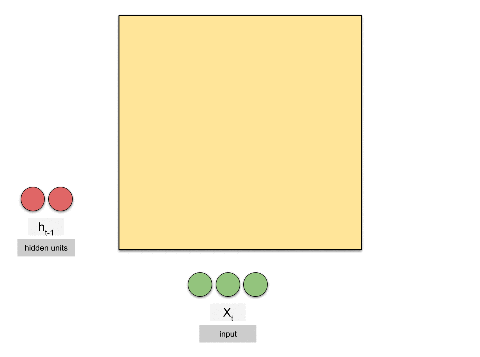

### 相关概念

- 词频

> 概念：词出现的频率
> 
> [分类](https://www.jianshu.com/p/6be7d4d85477):绝对词频和相对词频。前者表示词项在(当前/所有)文档中出现的频率。后者表示归一化的词频，用TF-IDF(Term Frequency-Inverse Document Frequency))表示，TF值越大，表示这个词项越重要；IDF值越大 表示该词项出现的文档数越少，它越能够把文档区分出来，于是就越重要。

> 
> 
> 

- 序列的概率

> 1. 一段自然语言文本看作一段离散的时间序列
> 
> 2. 通过相对词频计算
> 
> 3. 通过n元语法计算。n元语法是基于 n−1 阶马尔可夫链的概率语言模型。特点是n权衡了计算复杂度和模型准确性。缺点是序列长度增加时，计算和存储多个词共同出现的概率的复杂度会呈指数级增加。(马尔可夫假设是指一个词的出现只与前面 n 个词相关; 当 n 较小时， n 元语法往往并不准确.当n较大时，需要计算并存储大量的词频和多词相邻频率。)
> 
> 4. 通过循环神经网络计算

- 语言模型

> 1. 用于输出序列的概率值
> 2. 语言模型参数，为计算语言模型，我们需要计算词的概率，以及一个词在给定前几个词的情况下的条件概率
> 3. 评价指标：困惑度，任何一个有效模型的困惑度必须小于类别个数。困惑度是对交叉熵损失函数做指数运算后得到的值。特点如下。

```
最佳情况下，模型总是把标签类别的概率预测为1，此时困惑度为1；
最坏情况下，模型总是把标签类别的概率预测为0，此时困惑度为正无穷；
基线情况下，模型总是预测所有类别的概率都相同，此时困惑度为类别个数。
```

- 对时序数据采样

> 原则：样本的标签序列为这些字符分别在训练集中以下一个字符开始的序列。如“想要有直升机”，训练集为‘想要有直升’，标签序列为“要有直升机”
> 
> 分类：随机采样和相邻采样。其中**随机采样**是在原始序列上的任意位置开始截取固定长度的子序列，该采样的缺点是无法用小批量最终时间步的隐藏状态来初始化下一个小批量的隐藏状态，因为相邻两个序列的位置随机。**相邻采样**是相邻的两个随机小批量在原始序列上的位置相毗邻，特点如下。
> 
> 1. 只需在每一个迭代周期开始时初始化隐藏状态；
> 
> 2. 当多个相邻小批量通过传递隐藏状态串联起来时，模型参数的梯度计算将依赖所有串联起来的小批量序列；
> 
> 3. 同一迭代周期中，随着迭代次数的增加，梯度的计算开销会越来越大，可以在每次读取小批量前将隐藏状态从计算图中分离出来。 使模型参数的梯度计算只依赖一次迭代读取的小批量序列；

##### RNN

> 
> 
> 概念：使用循环计算的网络。循环计算的内容为当前时间步的隐状态。
> 
> 特点：可以表达某时间步的词基于文本序列中所有过去的词的条件概率;
> 通过隐藏状态来存储之前时间步的信息,并非刚性地记忆所有固定长度的序列;
> 
> 缺点：当时间步数较大或者时间步较小时，循环神经网络的梯度较容易出现衰减或爆炸。(梯度爆炸的解决办法：裁剪梯度（clip gradient），裁剪后梯度的L_2范数不大于裁剪阈值theta；梯度衰减的解决办法：使用门控循环网络)
> 
> 组成：隐藏状态，其作用是捕捉截至当前时间步的序列的历史信息，可理解为多层感知器中的隐藏层
> 
> 参数构成：隐状态和输入间的权重; 隐状态间转移的权重; 隐状态到输出间的权重。参数数量固定，不随时间步增长而增加
> 
> 训练事项：随机采样的序列训练时每次需要重新初始化隐状态；相邻采样需要保留每个隐状态的量，用于梯度计算

###### 字符集RNN

> - 样本制作。
> 
>     输入序列：想要有直升
>     标签序列：要有直升机
> 
> - 将词表示为one-hot向量
> - 训练时，对每个时间步的输出使用softmax;利用交叉熵损失函数计算标签于输出间的损失

###### 门控循环神经网络（gated recurrent neural network)

> - 出发点：更好地捕捉时间序列中时间步距离较大的依赖关系
> - 分类：门控循环单元(gated recurrent unit，GRU)和长短期记忆（long short-term memory，LSTM）
> - 门控循环单元组成：输入均为当前时间步输入和上个时间步的隐状态、输出由激活函数为sigmoid函数的全连接层计算得到、重置门（reset gate）、更新门（update gate）
> 1. 重置门作用：捕捉时间序列里短期的依赖关系；用来丢弃与预测无关的历史信息
> 2. 更新门作用：捕捉时间序列里长期的依赖关系；控制隐藏状态应该如何被包含当前时间步信息的候选隐藏状态所更新；结合重置门生成的候选隐状态和上一时间步的隐状态获得当前时间步的隐状态；
> - 长短期记忆网络组成：输入门（input gate）、输出门（output gate）、遗忘门（forget gate）、记忆细胞
> 1. 输入门控制当前时间步的输入 Xt 通过候选记忆细胞 C~t 如何流入当前时间步的记忆细胞。
> 2. 遗忘门控制上一时间步的记忆细胞 Ct−1 中的信息是否传递到当前时间步
